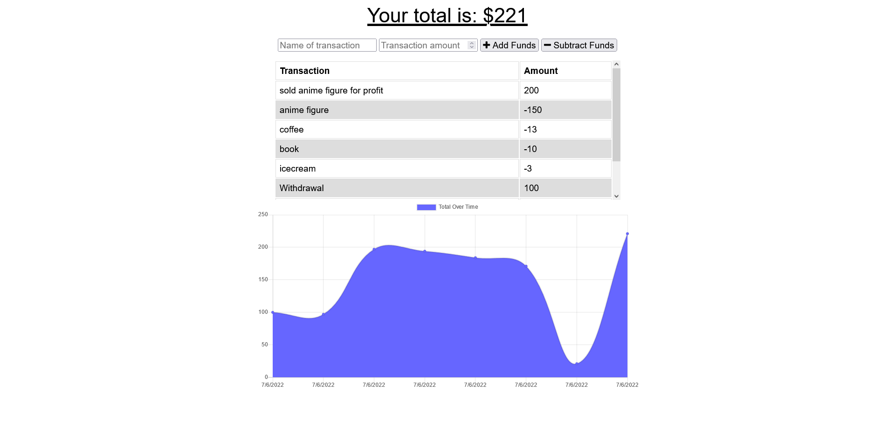

# Carl's Budget Tracker

## Description

A simple budget tracking progressive web app with offline capabilities via indexDB and a service worker. Enter income and expenses to keep a close eye on your cash flow as well as your net balance.

## Table of Contents

- [Installation](#installation)

- [Usage](#usage)

- [Credits](#credits)

- [License](#license)

- [Contributing](#contributing)

- [Tests](#tests)

- [Questions](#questions)

## Installation

n/a

## Usage

As a someone who can't control their spending habits, I need a way to easily keep track of my cash flow without a reliable source of internet.

## Credits

Created by CarlJMcGee

## License

[This project uses MIT License](./mit.txt)

## Contributing

[Click to see the Contributor Covenant guidelines](./code_of_conduct.md)

## Tests

n/a

## Questions?

If you have any issues, submit them to my [Github](https://github.com/CarlJMcGee)

or

If you have any other questions or inquiries, you can contact me at [Carl.Jack.McGee@gmail.com](mailto:Carl.Jack.McGee@gmail.com)

## [Check it out!](https://carls-budget-tracker.herokuapp.com/)

